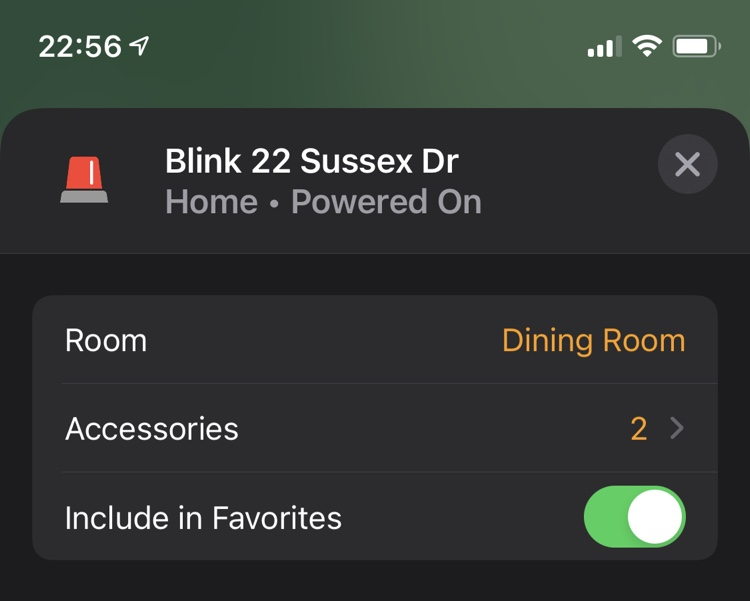
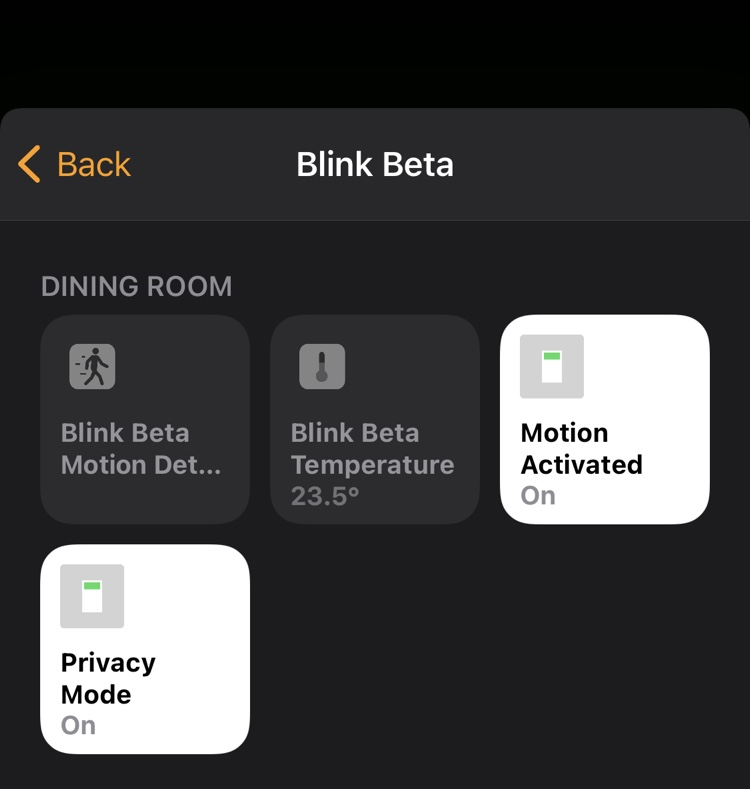

# homebridge-blink-for-home
[](https://github.com/homebridge/homebridge/wiki/Verified-Plugins)
[](https://www.npmjs.com/package/homebridge-blink-for-home)
[](https://www.npmjs.com/package/homebridge-blink-for-home)


## Overview

This enables Blink Cameras to the HomeBridge platform. This includes:
* Security System Arm / Disarming
* Occupied Switch
* Camera Thumbnails (Liveview WIP)
* Temperature Sensors
* Alerts

## Setup

To configure this set it up as a platform in your homebridge config.json file.


```
"platforms" : [
  {
    "name"     : "Blink",
    "username" : "<your blink email address>",
    "password" : "<your blink password>",
    "pin"      : "<pin>",
    "platform" : "Blink"
  }
]
```

### Configuration Parameters

* _name_: Only necessary if you want to support multiple Blink accounts. This is used to generate a unique client-id
* _username_: Your blink username
* _password_: Your blink password
* _pin_: After 2FA email, this is the PIN provided

### 2FA support
If you have 2FA enabled, you will need to first set the username / password to force the system to attempt to login. On first attempt it will trigger the email validation. With the PIN provided from the 2FA email, update the pin field to proceed. The pin is only needed once per account.

_NB: The Device in the email 2FA will appear to be an iPad Mini. This is intentional to increase masquerading._

## Features & Behaviors

This homebridge application includes a number of features such as:
* Motion detection
* Enable / Disable of Cameras
* Privacy Mode
* Thumbnail refreshing
* Liveview (currently on Gen1 cameras)

Many of these features are interconnected. Below describes the expected flows:

|        |Armed|Disarmed|
|--------|--------------|------------|
|✅PrivacyMode <br> ✅Camera|Thumbnail Refreshed||
|✅PrivacyMode <br> ❌Camera|||
|❌PrivacyMode <br> ✅Camera|Thumbnail Refreshed|Thumbnail Refreshed|
|❌PrivacyMode <br> ❌Camera||Last Thumbnail (no refresh)|

## Accessories
Two main accessory types will be present: `Security System` and `Camera` accessories. 

### Security System Accessories


* one `Security System` accessory per location (aka Network)
* Blink will be armed when the system is set to any of `Home`, `Away` or `Night` and disarmed when set to `Off`
* The specific state of Home/Away/Night is preserved but is only useful for automation scripts (eg: turn off all cameras but entrance camera when set to `Night`)


### Camera Accessories


* each `Camera` supports a number of sub accessories including temperature, motion sensor, motion tracking (when armed), and a privacy switch



* `privacy mode` prevents the perception that when the system is disarmed that people can be snooping. This is particularly important since even a stale thumbnail can give household members that feeling that the camera is active when its not.
* cameras can be disabled individually when the system is armed with the `Motion Activated` switch 

## Useful Resources:
* https://github.com/MattTW/BlinkMonitorProtocol
* https://github.com/fronzbot/blinkpy
* https://developers.homebridge.io/
* https://developer.apple.com/documentation/homekit/
